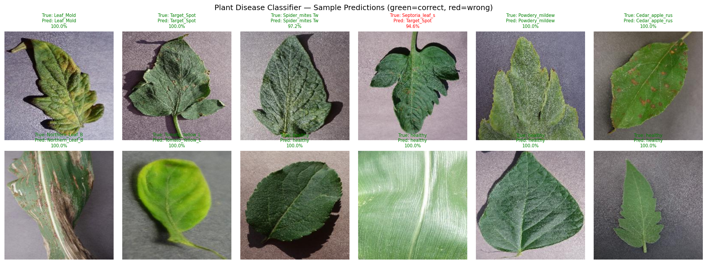
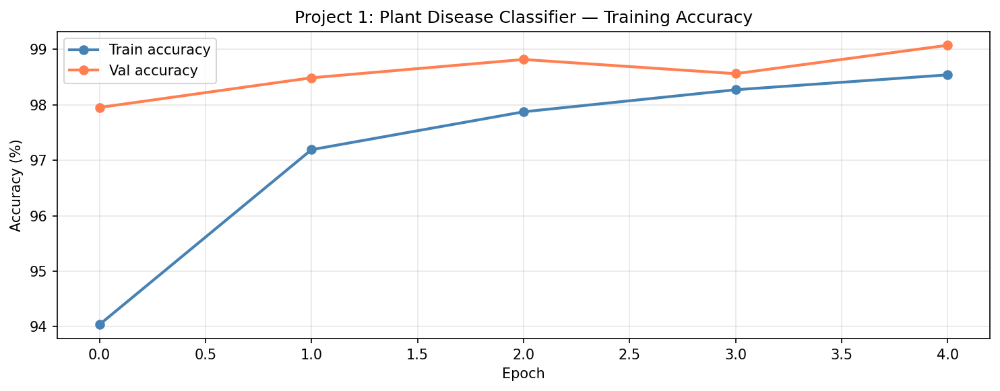

# 🌿 Plant Disease Classifier

[](https://huggingface.co/spaces/faisalimam19/plant-disease-classifier)
[](https://pytorch.org/)
[]()
[]()

> **AI-powered plant disease detection for Indian farmers.**
> Upload a photo of a plant leaf → get instant disease diagnosis + treatment recommendation.

---

## 🎯 Problem Being Solved

Indian farmers lose **20-30% of crops annually** to diseases they cannot identify early enough. Early detection enables targeted treatment and saves crops — but rural farmers rarely have access to agricultural experts.

This classifier lets a farmer point their phone camera at a leaf and instantly know:
- What disease is affecting the plant
- How confident the model is
- What treatment to apply immediately

---

## 🚀 Live Demo

**Try it here:** [huggingface.co/spaces/faisalimam19/plant-disease-classifier](https://huggingface.co/spaces/faisalimam19/plant-disease-classifier)



---

## 📊 Results

| Metric | Value |
|--------|-------|
| Training Images | 70,295 |
| Validation Images | 17,572 |
| Total Classes | 38 |
| Best Validation Accuracy | **99.07%** |
| Training Epochs | 5 |
| Training Time | ~16 minutes (T4 GPU) |



---

## 🌱 Supported Plants & Diseases

| Plant | Diseases Covered |
|-------|-----------------|
| Apple | Scab, Black Rot, Cedar Rust, Healthy |
| Corn | Cercospora Leaf Spot, Common Rust, Northern Leaf Blight, Healthy |
| Grape | Black Rot, Esca, Leaf Blight, Healthy |
| Tomato | Bacterial Spot, Early Blight, Late Blight, Leaf Mold, Septoria, Spider Mites, Target Spot, Yellow Leaf Curl Virus, Mosaic Virus, Healthy |
| Potato | Early Blight, Late Blight, Healthy |
| Pepper | Bacterial Spot, Healthy |
| Peach | Bacterial Spot, Healthy |
| + More | Blueberry, Cherry, Orange, Raspberry, Soybean, Squash, Strawberry |

---

## 🛠️ Tech Stack

| Component | Details |
|-----------|---------|
| Model | ResNet-18 (pretrained on ImageNet, fine-tuned on PlantVillage) |
| Framework | PyTorch + TorchVision |
| UI | Gradio 6 |
| Dataset | PlantVillage (87,000+ images) |
| Deployment | HuggingFace Spaces (free, permanent URL) |
| Training | Kaggle Notebook (Tesla T4 GPU) |
---

## 🧠 How It Works

1. User uploads plant leaf photo
2. Image resized to 224×224, normalized with ImageNet stats
3. ResNet-18 extracts features (11M parameters, pretrained)
4. Fine-tuned final layer classifies into 38 categories
5. Top-3 predictions + confidence scores returned
6. Treatment recommendation displayed
---

## 🔬 Model Architecture

```python
# Transfer Learning approach
model = ResNet-18 (pretrained=True)

# Freeze early layers — keep ImageNet knowledge
for param in model.parameters():
    param.requires_grad = False

# Unfreeze layer4 — adapt to plant disease features
for param in model.layer4.parameters():
    param.requires_grad = True

# Replace final layer — 1000 ImageNet classes → 38 plant classes
model.fc = nn.Linear(512, 38)

# Result: only ~14% of parameters trained
# Trainable: ~1.4M | Frozen: ~9.8M
```

---

## 📁 Repository Structure

| File | Description |
|------|-------------|
| `app.py` | Gradio web app |
| `class_names.json` | 38 class labels |
| `requirements.txt` | Dependencies |
| `training_curve.png` | Accuracy over epochs |
| `sample_images.png` | Dataset samples |
| `predictions.png` | Model predictions |
| `README.md` | Project documentation |
---

## ⚙️ Run Locally

```bash
git clone https://github.com/faisalimam1/plant-disease-classifier.git
cd plant-disease-classifier
pip install torch torchvision gradio Pillow
# Add plant_disease_model.pth to the folder
python app.py
```

---

## 👨‍💻 About

**Developed by Faisal Imam** as part of a 30-day AI Engineer Roadmap.

[](https://www.linkedin.com/in/faisalimam19)
[](https://www.kaggle.com/faisalimam19)
[](https://github.com/faisalimam1)

---

## 📄 Dataset

[New Plant Diseases Dataset](https://www.kaggle.com/datasets/vipoooool/new-plant-diseases-dataset) by vipoooool on Kaggle.
87,000+ images across 38 classes of healthy and diseased plant leaves.
